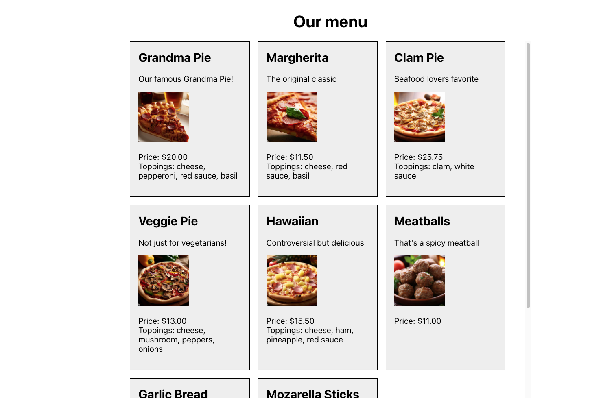

# Assessment: Weeks 1 -3

## Goals
1. create an Express API that serves data from a JSON file
1. create a React front end that fetches and displays the data
1. show loading and error states when fetching the data
1. display the data in a grid using a layout component

## What to build and how to submit
1. Copy the data from the `data.json` file in this repo. **Note**: You do not need to clone or fork this repo. Just copy the data.
1. Create a separate back-end repo that serves this data from an Express API.
1. Create a separate front-end repo using create-react-app that fetches and displays the data.
1. When you are finished, paste the URL for each repo in [the spreadsheet next to your name](https://docs.google.com/spreadsheets/d/1so3_Vwgsun-HdBG-w50K9RHzrXYHOZAPKd36tpwtVCU/edit?usp=sharing).

## This project is required
In this class you are not just practicing your technical skills. Just as importantly, you are also practicing the right way to handle assignments that are given to you on the job.

This means:
- You are required to complete and submit this project by the deadline of **Tuesday, August 1, 9:00 a.m. NYC time**.
- You must complete all of the goals to the exact specifications.
- If you encounter a blocker (technical, personal, a problem with instructions), you should **communicate with me immediately** about this.
- Treat this like a real takehome interview.
    - Make it look good (the example screen shots are just a starting point)
    - Consider edge cases, error handling, and other small touches
    - Someone who looks at this should want to hire you.

## Detailed requirements
### Express API
1. The API should have the following routes:

|path|methods|notes|
|----|-------|-----|
|`/`|`GET`|health check route: returns `{ data: "Service is running!" }`|
|`/items`|`GET`|returns an array of all the menu items|
|`/items/:id`|`GET`|returns an item with the given `id`; returns a `404` if the item is not found
2. The API should return **json** in the following format.

- If the response is a success: `{ data: <the data requested> }` with status code **200**
- If the response is an error: `{ error: <the error message> }` with the appropriate status code (404, 500, etc.)

3. The API should listen on any port specified in `process.env.PORT`, or use port 8888 as a default.

### Front end
1. Fetch the items from the API. **Use the fetch library** (not axios).
1. Display the items in a grid. Make the grid responsive as best you can. Use a reusable **layout component** for the grid.
1. Display the item name, short description, image, price, and toppings. Here is an **example** screen shot. Feel free to make yours look better!

1. Display a loading UI while the call to your API is in progress. Here is an **example** screen shot. Feel free to make yours look better!

1. Handle any errors that are thrown by displaying them in the application. This includes **server errors** (non-2xx responses from your API) and **front end errors** (errors that are thrown in the front-end code). Here is an **example** screen shot. Feel free to make yours look better!

